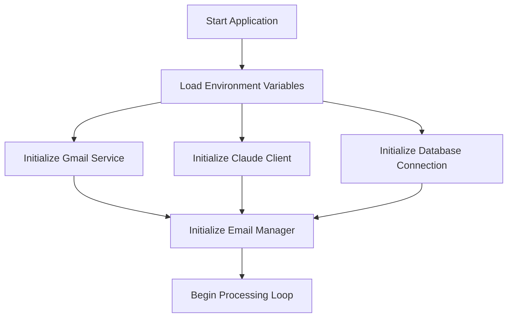
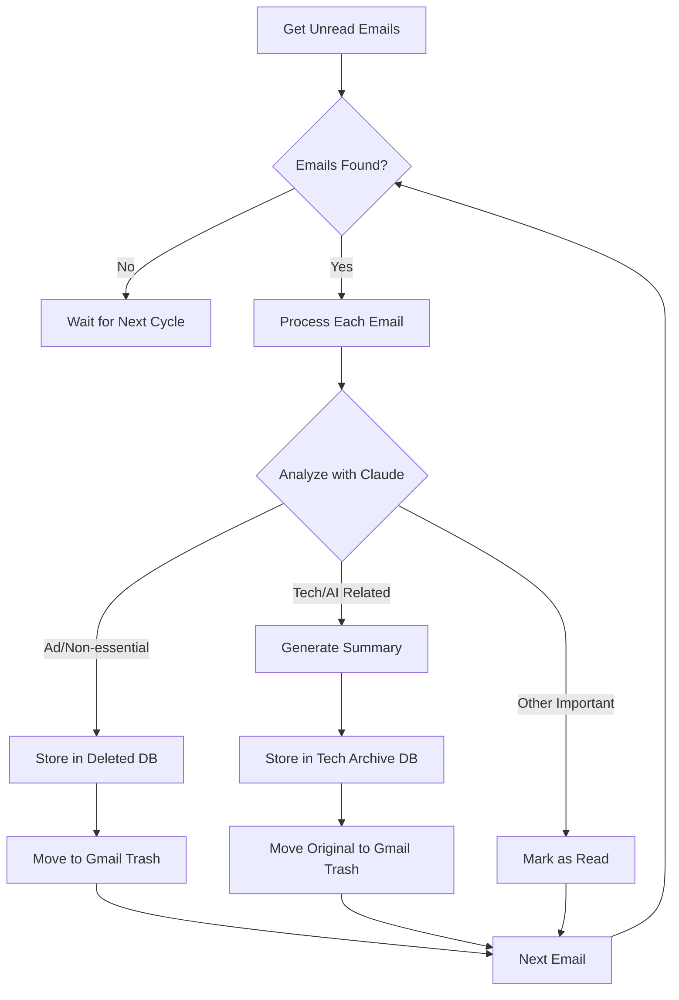
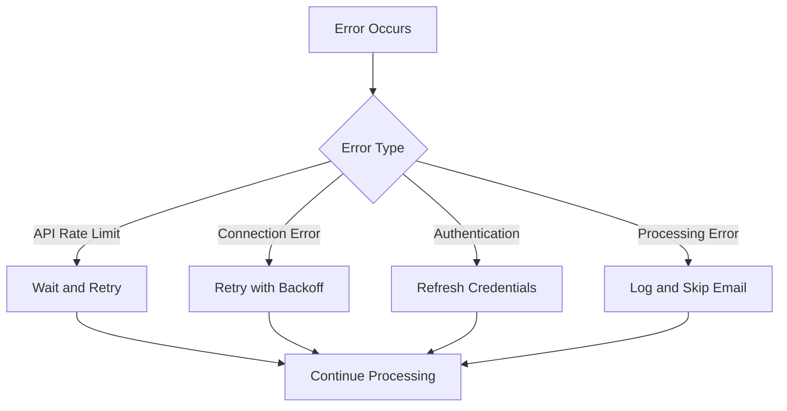

# Email Manager Process Flow and Pseudocode

## Process Flow

### 1. Initialization Phase


### 2. Email Processing Flow


### 3. Error Handling Flow


## Detailed Pseudocode

### 1. Main Application Loop

```python
# Main application loop pseudocode
FUNCTION main():
    # Initialize components
    config = load_environment_variables()
    gmail_service = initialize_gmail_service(config)
    claude_client = initialize_claude_client(config)
    db_manager = initialize_database(config)
    
    email_manager = EmailManager(gmail_service, claude_client, db_manager)
    
    WHILE true:
        TRY:
            email_manager.process_unread_emails()
            wait_for_next_cycle()
        CATCH Exception as e:
            log_error(e)
            handle_system_error(e)
```

### 2. Email Processing Logic

```python
# Email processing pseudocode
FUNCTION process_unread_emails():
    emails = get_unread_emails()
    
    FOR each_email IN emails:
        TRY:
            analysis = analyze_email_with_claude(each_email)
            
            IF analysis.is_non_essential():
                # First store in database
                success = record_deleted_email(each_email)
                IF success:
                    # Only delete from Gmail if database storage succeeded
                    move_to_gmail_trash(each_email)
                    log_info(f"Non-essential email {each_email.id} stored and deleted")
                
            ELIF analysis.is_tech_related():
                # Generate summary and store in database
                summary = generate_tech_summary(each_email)
                success = store_tech_content(each_email, summary)
                IF success:
                    # Only delete from Gmail if database storage succeeded
                    move_to_gmail_trash(each_email)
                    log_info(f"Tech email {each_email.id} archived and deleted")
            
            ELSE:
                # Important emails just get marked as read
                mark_as_processed(each_email)
            
        CATCH EmailProcessingError as e:
            log_error(e)
            continue
```

### 3. Claude Analysis Logic

```python
# Claude analysis pseudocode
FUNCTION analyze_email_with_claude(email):
    prompt = construct_analysis_prompt(email)
    
    response = claude_client.analyze(
        content=prompt,
        functions=[
            {
                "name": "categorize_email",
                "parameters": {
                    "category": ["non_essential", "tech_ai", "important"],
                    "confidence": "float",
                    "reasoning": "string"
                }
            }
        ]
    )
    
    RETURN parse_claude_response(response)
```

### 4. Database Operations

```python
# Database operations pseudocode
FUNCTION record_deleted_email(email):
    TRY:
        WITH database.transaction():
            INSERT INTO deleted_emails (
                email_id,
                subject,
                sender,
                content,  # Store full content before deletion
                deletion_date
            ) VALUES (
                email.id,
                email.subject,
                email.sender,
                email.content,
                current_timestamp()
            )
            RETURN True
    CATCH DatabaseError as e:
        log_error(f"Failed to store deleted email {email.id}: {str(e)}")
        RETURN False

FUNCTION store_tech_content(email, summary):
    WITH database.transaction():
        INSERT INTO tech_content (
            email_id,
            subject,
            sender,
            content,
            summary,
            received_date,
            category
        ) VALUES (
            email.id,
            email.subject,
            email.sender,
            email.content,
            summary,
            email.date,
            determine_tech_category(email)
        )
```

### 5. Error Handling and Retry Logic

```python
# Error handling pseudocode
FUNCTION handle_processing_error(error, email):
    IF error.is_rate_limit():
        wait_appropriate_time()
        RETURN retry_processing(email)
        
    ELIF error.is_connection():
        RETURN retry_with_exponential_backoff(email)
        
    ELIF error.is_auth():
        refresh_credentials()
        RETURN retry_processing(email)
        
    ELSE:
        log_permanent_failure(email, error)
        RETURN False
```

## Key Processing Rules

1. Email Classification Priority:
   - First check for tech/AI content
   - Then check for non-essential/advertising content
   - Finally categorize as important if neither above

2. Tech/AI Content Criteria:
   - Contains technical discussions
   - Industry news and updates
   - Product announcements in tech/AI
   - Research papers or technical blogs
   - Developer newsletters

3. Non-essential Content Criteria:
   - Marketing promotions
   - Social media notifications
   - Generic newsletters
   - Automated system notifications
   - Sales and promotional content

4. Processing Safeguards:
   - Rate limiting for API calls. We should check if there are any API rate limits, and use one function to check how many calls we have left and to wait if we are close to the limit.
   - Transaction safety for database operations
   - Duplicate detection
   - Error recovery mechanisms
   - Logging of all operations in the database so we know the email id, subject, sender, and content and where it was moved to. This can help in the future to train on emails that were deleted unncessarily.

## System States

1. Normal Operation:
   - Processing emails within normal timeframes
   - APIs responding normally
   - Database connections stable

2. Degraded Operation:
   - API rate limits approaching
   - Increased response times
   - Minor errors being handled

3. Error State:
   - API authentication failures
   - Database connection issues
   - Critical processing errors

4. Recovery State:
   - Refreshing credentials
   - Reconnecting to services
   - Clearing error conditions

## Performance Considerations

1. Batch Processing:
   - Process emails in batches of 50
   - Implement parallel processing where possible
   - Use connection pooling for database

2. Resource Management:
   - Implement timeouts for API calls
   - Limit memory usage for large emails
   - Cache frequently accessed data

3. Rate Limiting:
   - Track API usage
   - Implement backoff strategies
   - Queue requests when approaching limits
